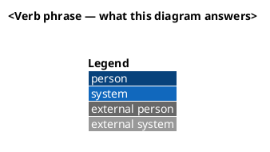

# Diagram conventions

## Files

- One diagram per `.puml` file, in `outputs/`, kebab-case, prefixed by its
  C4 level: `context-payments.puml`, `container-payments.puml`,
  `component-ledger-adapter.puml`, `sequence-refund-flow.puml`.
- The rendered `.png` sits next to its `.puml`, same basename (produced by
  `/publish` — never hand-edit a rendered file).
- Documents reference the `.png` (relative link), never the `.puml`, so
  `outputs/` reads correctly on any markdown viewer.

## C4 discipline

- Start at **context** (systems and people); add **container** and
  **component** views only where the design actually changes something at
  that depth. A diagram that shows everything explains nothing.
- Sequence diagrams only for flows where ordering/failure behavior is the
  point (sagas, retries, migrations) — not for simple request/response.
- Use the C4-PlantUML standard library:
  `!include <C4/C4_Context>` (or `C4_Container`, `C4_Component`) — bundled
  with PlantUML, no network fetch at render time.

## Style

Every diagram starts the same way:

- One question per diagram; the title states it.
- Existing systems plain; new/changed elements get
  `$tags="new"` + `AddElementTag("new", $bgColor="#1a7f37")` so reviewers
  see the delta at a glance. Deprecated paths tag `"removed"`, gray, dashed.
- No colors beyond those two tags and the C4 defaults; no icons/sprites —
  they date badly and render inconsistently.
- Max ~10 elements per diagram; past that, split by level or by subdomain.
- Relationship labels are verb phrases with protocol where it matters:
  `Rel(api, ledger, "posts entries", "gRPC")`.

## Rendering

- Renderer preference: local `plantuml` CLI if installed, else
  `docker run --rm -v <outputs>:/data plantuml/plantuml -tpng /data/<file>`,
  one-shot — never a standing service.
- Render failures are findings, not stoppers: report the file and the error,
  keep the `.puml` committed.
